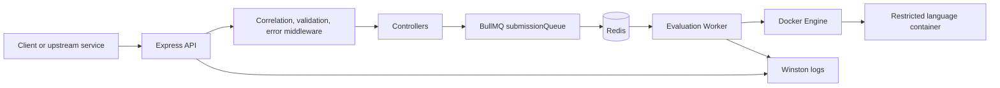
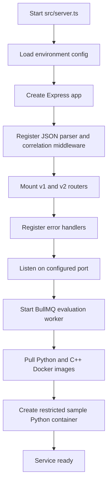
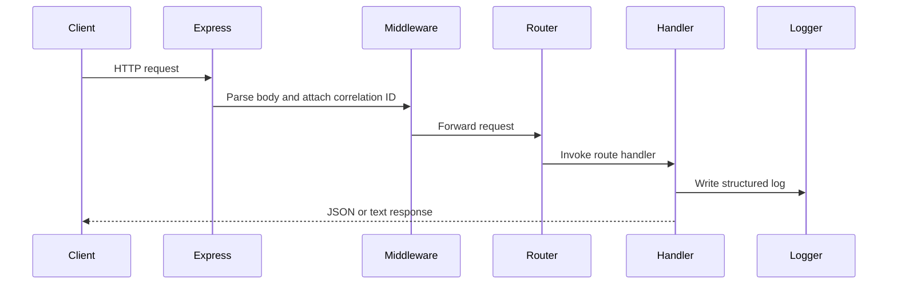
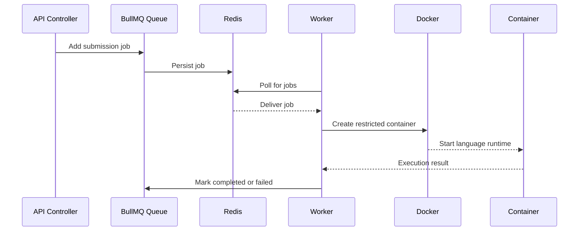

# Codeduck Evaluation Service

Evaluation Service is a TypeScript + Express microservice for accepting evaluation-related API traffic, preparing isolated execution infrastructure, and processing submission jobs through a Redis-backed BullMQ queue.

The service is designed as part of a larger online judge or coding-platform backend. Its core responsibility is to evaluate submitted code safely and asynchronously. The current codebase contains the API shell, request validation, logging, Redis queue setup, worker bootstrapping, and Docker container utilities needed for sandboxed execution.

## Table of Contents

- [Project Overview](#project-overview)
- [Tech Stack](#tech-stack)
- [Libraries Used](#libraries-used)
- [Project Structure](#project-structure)
- [Runtime Architecture](#runtime-architecture)
- [Application Flow](#application-flow)
- [Flow Diagrams](#flow-diagrams)
- [API Routes](#api-routes)
- [Configuration](#configuration)
- [Local Setup](#local-setup)
- [Operational Notes](#operational-notes)
- [Current Implementation Status](#current-implementation-status)

## Project Overview

This service is built around an asynchronous evaluation model:

1. API requests enter through Express routers.
2. Request metadata receives a correlation ID for traceable logging.
3. Incoming payloads can be validated with Zod middleware.
4. Evaluation jobs are intended to be pushed into a BullMQ submission queue.
5. A worker consumes jobs from Redis.
6. Docker utilities prepare language images and create restricted containers for code execution.
7. Errors flow through centralized error middleware.

At the moment, the service exposes health and ping routes, starts the BullMQ worker on server boot, pulls supported language images, and demonstrates creating a restricted Python container.

## Tech Stack

| Area | Technology |
| --- | --- |
| Runtime | Node.js |
| Language | TypeScript |
| Web framework | Express 5 |
| Queue system | BullMQ |
| Queue backend | Redis |
| Redis client | ioredis |
| Container runtime | Docker |
| Docker SDK | dockerode |
| Validation | Zod |
| Logging | Winston + winston-daily-rotate-file |
| Environment config | dotenv |
| Request tracing | UUID + AsyncLocalStorage |
| Database dependency | Mongoose is installed, but MongoDB connection code is currently commented out |

## Libraries Used

### Production Dependencies

- `express`: HTTP server and route handling.
- `bullmq`: Queue and worker abstraction for asynchronous submission processing.
- `ioredis`: Redis client used by BullMQ and direct Redis connections.
- `dockerode`: Node.js SDK for Docker image pulling and container creation.
- `dotenv`: Loads environment variables from `.env`.
- `zod`: Runtime request body and query validation.
- `winston`: Structured application logging.
- `winston-daily-rotate-file`: Daily log rotation into the `logs/` directory.
- `uuid`: Generates request correlation IDs.
- `axios`: HTTP client dependency, likely intended for service-to-service calls.
- `mongoose`: MongoDB ODM dependency. The database connection is scaffolded but not active.

### Development Dependencies

- `typescript`: TypeScript compiler.
- `ts-node`: Runs TypeScript directly in development.
- `nodemon`: Restarts the service automatically during development.
- `@types/node`, `@types/express`, `@types/dockerode`: Type definitions.

## Project Structure

```text
src/
  server.ts                         # Express app bootstrap and startup workflow
  config/
    index.ts                        # Environment-driven server config
    redis.config.ts                 # Redis and BullMQ connection factory
    logger.config.ts                # Winston logger with correlation IDs
    db.config.ts                    # Commented MongoDB connection scaffold
  controllers/
    ping.controller.ts              # Ping route handler
  middlewares/
    correlation.middleware.ts       # Per-request correlation ID setup
    error.middleware.ts             # App and generic error handlers
  queues/
    submission.queue.ts             # BullMQ submission queue definition
  routers/
    v1/
      index.router.ts               # v1 route registry
      ping.router.ts                # Ping and health routes
    v2/
      index.router.ts               # Empty v2 router scaffold
  utils/
    constants.ts                    # Queue and Docker image constants
    containers/
      createContainer.ts            # Restricted Docker container factory
      pullImage.utils.ts            # Docker image pull helpers
    errors/
      app.error.ts                  # Custom application error classes
    helpers/
      request.helpers.ts            # AsyncLocalStorage correlation helpers
  validators/
    index.ts                        # Generic request validation middleware
    ping.validator.ts               # Ping request schema
```

## Runtime Architecture

The application starts from `src/server.ts`.

Startup responsibilities:

1. Load Express and register JSON body parsing.
2. Attach request correlation middleware.
3. Mount API routers:
   - `/api/v1`
   - `/api/v2`
4. Register centralized error handlers.
5. Start the HTTP server on `serverConfig.PORT`.
6. Start the BullMQ evaluation worker.
7. Pull supported Docker images:
   - `python:3.8-slim`
   - `gcc:latest`
8. Create and start a restricted sample Python container.

The service currently runs API and worker logic in the same Node.js process. For production scale, these can be split into separate processes that share Redis and the same queue name.

## Application Flow

### Request Flow

1. Client sends a request to the Express API.
2. `express.json()` parses JSON request bodies.
3. `attachCorrelationIdMiddleware` generates a UUID correlation ID.
4. The correlation ID is stored in `AsyncLocalStorage`.
5. Routers dispatch the request to versioned route handlers.
6. Validators can parse request bodies or query parameters using Zod.
7. Controllers run business logic and return responses.
8. Errors are handled by `appErrorHandler` or `genericErrorHandler`.
9. Winston logs include timestamp, level, message, correlation ID, and metadata.

### Queue Flow

1. A submission job is intended to be added to `submissionQueue`.
2. BullMQ stores the job in Redis under the `submissionQueue` queue.
3. Jobs use default retry behavior:
   - 3 attempts
   - exponential backoff
   - initial delay of 3 seconds
4. `evaluation.worker.ts` creates a BullMQ worker for the same queue.
5. The worker receives jobs and logs the job payload.
6. Worker lifecycle events are logged:
   - `completed`
   - `failed`
   - `error`

### Container Execution Flow

1. On startup, Docker images are pulled with `dockerode`.
2. `pullAllImages()` pulls the Python and C++ images in parallel.
3. `createNewDockerContainer()` creates a Docker container with execution limits.
4. The container is configured with:
   - memory limit
   - process limit
   - CPU quota
   - no network access
   - no privilege escalation
   - automatic removal after exit
5. The current startup code creates a sample Python container using:

```ts
{
  imageName: PYTHON_IMAGE,
  cmdExecutable: ["python", "hello.py"],
  memoryLimit: 512 * 1024 * 1024
}
```

## Flow Diagrams

### High-Level Architecture



### Server Startup Flow



### Request Handling Flow



### Submission Evaluation Flow



## API Routes

### `GET /api/v1/ping`

Returns a ping response.

Current handler response:

```json
{
  "message": "Pong!"
}
```

Note: this route currently uses `validateRequestBody(pingSchema)` even though it is a `GET` route. The schema expects:

```json
{
  "message": "some text"
}
```

For a conventional health/ping endpoint, this validation should either be removed or changed to query validation.

### `GET /api/v1/ping/health`

Returns a simple health response:

```text
OK
```

### `/api/v2`

The v2 router is mounted but currently has no registered routes.

## Configuration

Environment variables are loaded through `dotenv`.

| Variable | Default | Purpose |
| --- | --- | --- |
| `PORT` | `3003` | HTTP server port |
| `SUBMISSION_SERVICE_URL` | `http://localhost:3000/api/v1` | Upstream submission service base URL |
| `REDIS_HOST` | `localhost` | Redis host |
| `REDIS_PORT` | `6379` | Redis port |

Example `.env`:

```env
PORT=3003
SUBMISSION_SERVICE_URL=http://localhost:3000/api/v1
REDIS_HOST=localhost
REDIS_PORT=6379
```

## Local Setup

### Prerequisites

- Node.js
- npm
- Redis running locally or reachable through `REDIS_HOST` and `REDIS_PORT`
- Docker daemon running locally

### Install Dependencies

```bash
npm install
```

### Start In Development Mode

```bash
npm run dev
```

### Start Without Nodemon

```bash
npm start
```

The service starts on:

```text
http://localhost:3003
```

unless `PORT` is overridden.

## Operational Notes

### Logging

Logs are emitted to the console and to daily rotated files in:

```text
logs/%DATE%-app.log
```

Each structured log entry includes:

- `level`
- `message`
- `timestamp`
- `correlationId`
- extra metadata under `data`

### Redis and BullMQ

`createNewRedisConnection()` creates dedicated Redis connections for BullMQ queues and workers. `maxRetriesPerRequest` is set to `null`, which is required by BullMQ for blocking operations.

### Docker Sandbox Controls

Containers created by `createNewDockerContainer()` are restricted with:

- `Memory`: caller-provided memory limit
- `PidsLimit`: 10 processes
- `CpuQuota`: 50% of one CPU core
- `CpuPeriod`: 100ms
- `SecurityOpt`: `no-new-privileges`
- `NetworkMode`: `none`
- `AutoRemove`: enabled

These controls are a strong starting point for safe code execution, but production-grade sandboxing should also consider timeouts, filesystem isolation, output limits, user namespaces, seccomp profiles, and cleanup around stuck containers.

## Current Implementation Status

Implemented:

- Express server bootstrap
- Versioned router structure
- Ping and health routes
- Zod validation middleware
- Correlation ID middleware using `AsyncLocalStorage`
- Winston JSON logger with daily file rotation
- Redis connection factory
- BullMQ submission queue
- BullMQ evaluation worker
- Docker image pulling utilities
- Restricted Docker container creation utility
- Custom application error classes

Scaffolded or not fully wired yet:

- Real submission evaluation endpoint
- Adding submission jobs from an API route
- Executing submitted source code inside containers
- Capturing stdout, stderr, exit code, runtime, and memory usage
- Returning evaluation results to the submission service
- MongoDB persistence
- v2 API routes
- Automated tests

## Suggested Evaluation Lifecycle

The intended end-to-end lifecycle can evolve into:

1. Submission service sends code, language, problem ID, and test metadata to Evaluation Service.
2. Evaluation Service validates the request.
3. Evaluation Service creates a job in `submissionQueue`.
4. Worker picks up the job.
5. Worker chooses the Docker image based on language.
6. Worker creates an isolated container with CPU, memory, process, and network limits.
7. Worker copies or mounts source code and test runner files into the container.
8. Container executes the code against test cases.
9. Worker captures execution output and verdict.
10. Worker reports the result back to the submission service.
11. Logs across API and worker can be traced with correlation IDs.

